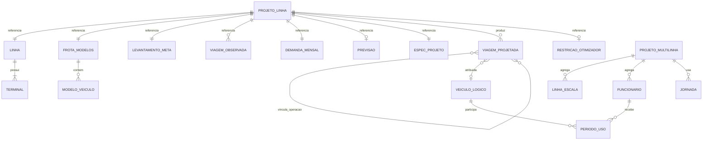
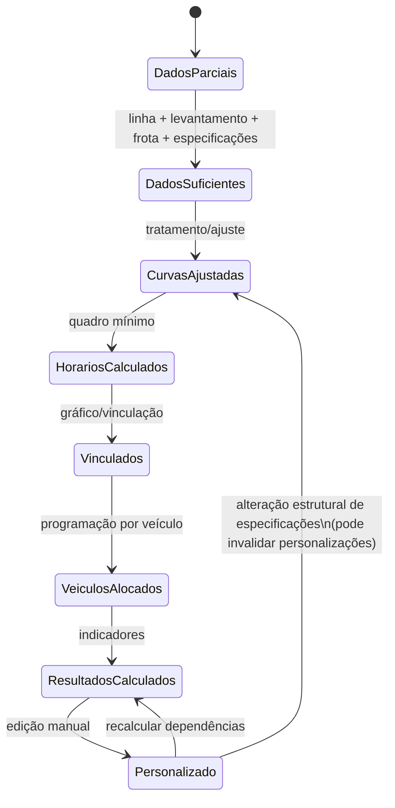
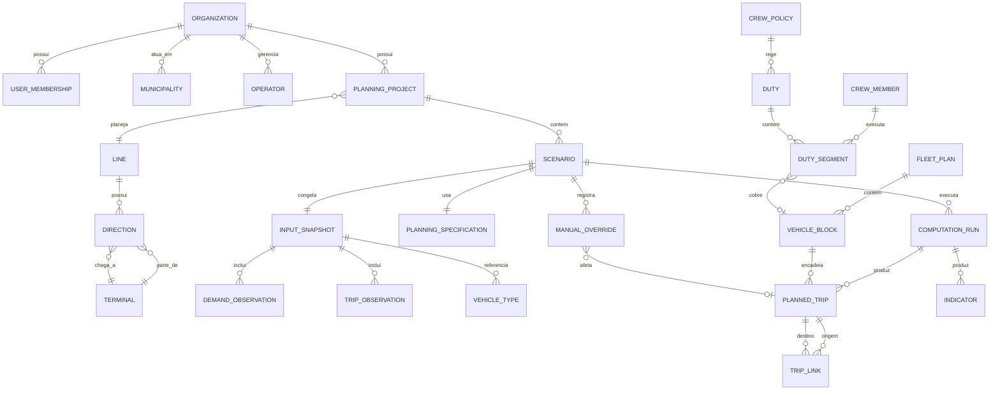

# OferBus — Reconstructed Domain Model v0.1

**Status:** reconstrução arqueológica; não é ainda o modelo de implementação definitivo.  
**Base examinada:** pacote legado `OferBus.tar.xz`, especialmente `VERSAO ATUAL/ofb_code/ofb2008c`.  
**Regra:** o que é proposto para a futura versão web é mantido separado do domínio efetivamente recuperado.

## 1. Convenções de evidência

- **CONFIRMADO NO CÓDIGO** — semântica observável diretamente no fonte legado.
- **CONFIRMADO NA DOCUMENTAÇÃO** — descrito em manual/documentação histórica.
- **CONFIRMADO NO CÓDIGO E NA DOCUMENTAÇÃO** — evidência convergente.
- **INFERIDO** — conclusão necessária ou fortemente sugerida, mas sem declaração explícita suficiente.
- **RELATADO PELO USUÁRIO** — informação corrente ainda não localizada no legado.
- **INCERTO** — há evidência parcial, ambígua ou conflitante.
- **NÃO RECUPERADO** — dependência/semântica ainda ausente.

## 2. Resultado central da reconstrução

O domínio legado não é adequadamente descrito apenas por `Linha → Viagem → Veículo`. O OferBus modela uma **cadeia de planejamento** na qual dados levantados são transformados em curvas minuto a minuto, especificações de projeto geram viagens planejadas e estas são ligadas entre si, alocadas a veículos e, nas versões tardias, a tripulantes. O sistema preserva ainda distinções entre dados levantados, resultados calculados e intervenções manuais do projetista.

A unidade de planejamento histórica é essencialmente um **Projeto de Linha (`.OFB`)**, que agrega por referência diversos artefatos persistidos. Em 2008 surge um **Projeto Multilinha (`.PML`)** que reúne linhas e recursos de tripulação, mas essa camada permanece parcialmente evolutiva.

## 3. Ambiguidades fechadas nesta passagem

### 3.1 Tipos de operação da linha — CONFIRMADO NO CÓDIGO

`MGERAL.BAS::Str_Tipo_Operacao` (`~4294–4302`):

| Código | Terminologia OferBus |
|---:|---|
| 0 | Circular |
| 1 | Radial-Circular |
| 2 | Diametral-Circular |
| 3 | Periférica-Circular |
| 4 | Radial |
| 5 | Diametral |
| 6 | Periférica |

A função `Radial_Ou_Circular` agrupa 0–3 e 4–6; o comportamento do programa indica que os primeiros são tratados com uma direção operacional principal e os últimos com duas direções. A terminologia deve ser preservada no modo de compatibilidade, mesmo que a modelagem moderna use conceitos mais gerais de direção/itinerário.

### 3.2 Semântica de `TpObjViagem.Tipo` — CONFIRMADO NO CÓDIGO

A declaração em `MGLOBAL.BAS:316–329` comenta apenas `0=normal, 1=expresso`, mas a lógica posterior amplia `Tipo` como **bit field de classe, origem e intervenção manual**. A reconstrução cruzada usa `MPROCEDI.BAS::Devolve_Caracteres_Atributos`, `FINFVIA2.FRM` e rotinas de importação/edição.

| Bit/valor | Semântica recuperada |
|---:|---|
| 1 | viagem expressa |
| 2 | viagem criada pelo OferBus ou pelo projetista, em oposição à base levantada/importada |
| 4 | horário alterado |
| 8 | qualifica origem manual/importada: combinado com 2 indica criação pelo projetista; sem 2 indica importação |
| 16 | vínculo de entrada/origem alterado manualmente |
| 32 | vínculo de saída/destino alterado manualmente |

Combinações historicamente observáveis: `0` normal; `1` expressa; `2` retorno normal criado automaticamente; `3` retorno expresso criado automaticamente; `8` normal importada; `9` expressa importada; `10` normal criada pelo projetista; `11` expressa criada pelo projetista.

**Implicação moderna:** não preservar a semântica apenas como inteiro opaco. O modelo novo deve expor `service_type`, `provenance`, `schedule_overridden`, `incoming_link_overridden`, `outgoing_link_overridden`, mantendo `legacy_type_bits` para round-trip de arquivos históricos.

### 3.3 Semântica de `TpObjViagem.Vinculos` — CONFIRMADO NO CÓDIGO

`Vinculos` contém duas parcelas de dois bits:

- vínculo de entrada/origem: `Vinculos Mod 4`;
- vínculo de saída/destino: `Vinculos \ 4`.

Para cada parcela:

| Valor | Semântica |
|---:|---|
| 0 | indefinido |
| 1 | garagem |
| 2 | área de estocagem |
| 3 | operação / outra viagem |

Evidência: `MMARCHA1.BAS::Seta_Vinculo` e rótulos de `FINFVIA2.FRM`.

**Implicação moderna:** representar os dois extremos separadamente, com vínculo estruturado e referência à viagem quando o valor for `operação`; manter a codificação compacta apenas no adaptador legado.

### 3.4 Horários reais e virtuais — CONFIRMADO NO CÓDIGO

`TpObjViagem` possui `SaidaReal`, `SaidaVirtual`, `ChegadaReal`, `ChegadaVirtual` (`MGLOBAL.BAS:316–329`). As rotinas `MFUNCOES.BAS::Calc_SaidaVirtual` e `Calc_ChegadaVirtual` mostram que os horários virtuais incorporam tempo de embarque/desembarque em função da lotação admissível e do índice de renovação.

Em essência, para uma saída real `t`:

- `SaidaVirtual = SaidaReal − round(EssaLotacao(t) * TempoEmbarque / 60)`;
- `ChegadaVirtual = SaidaReal + TempoViagemAjustado(t) + round(EssaLotacao(t) * TempoDesembarque / 60)`;

com correções adicionais nas bordas da faixa levantada. O arredondamento legado usa comparação com fração `> 0,5` em alguns trechos, portanto a implementação compatível deve reproduzir exatamente a função histórica antes de qualquer normalização.

Há um comentário TODO no fonte indicando dúvida sobre usar lotação em vez de passageiros efetivamente transportados na saída virtual. Isso é **dívida científica/técnica histórica**, não autorização para corrigir silenciosamente.

## 4. Léxico canônico legado

| Conceito legado | Evidência | Significado recuperado |
|---|---|---|
| Linha | `TpLinha` | unidade operacional contendo identificação, terminais, extensão, tipo de operação, custos, IR, estocagem e parâmetros de reserva |
| Sentido | arrays `1 To 2`; `TpObjViagem.Sentido` | direção operacional; nem todo tipo de linha utiliza duas |
| Terminal | `TpLinha.Terminal(1 To 2)` | extremidade operacional nomeada |
| Área de estocagem | `TpLinha.AreaEstocagem(1 To 2)` | capacidade/possibilidade lógica de manter veículos no terminal; afeta geração e vínculos |
| Garagem | vínculos de viagem e programação | origem/destino possível de bloco; geometria/distância não está plenamente incorporada |
| Levantamento | `TpLevantamento`, `.LEV/.DCL` | observação de viagens de um dia típico |
| Viagem levantada | `TpViagem` | horário, passageiros, passageiros no trecho crítico e tempo de viagem |
| Demanda mensal | `TpDemanda` | série de até 60 meses |
| Previsão | `TpPrevisao` | seleção/configuração e erro dos modelos de previsão |
| Índice de renovação (IR) | `TpLinha.IndiceRenova`, curvas IR | relação usada para transformar passageiros transportados em carga no trecho crítico |
| Nível de serviço | `TpEspecProjeto.NivelServico`, `NS` | nível A–F/índice relacionado à capacidade e ocupação admissível |
| Especificações de projeto | `TpEspecProjeto` | parâmetros que governam cálculo da oferta e geração de horários |
| Viagem projetada / objeto viagem | `TpObjViagem` | unidade calculada/editável com tempos real/virtual, vínculos, veículo, tripulação e NS |
| Quadro de horários mínimo | `Calcula_Quadro_Horarios_Minimo_2007` | conjunto inicial de viagens necessário segundo demanda/capacidade/intervalo e retornos |
| Gráfico de marcha | `FMARCH04.FRM`, `MMARCHA1.BAS` | visualização + editor da programação temporal e dos vínculos |
| Vinculação | `Vinculos`, rotinas de marcha | ligação entre viagens/garagem/estocagem formando continuidade operacional |
| Programação por veículo | `FPROGRAC`, rotinas de alocação | cadeias de viagens atribuídas a veículos |
| Frota efetiva | resultados | quantidade de veículos simultaneamente/efetivamente exigida; no legado calculada a partir dos IDs alocados |
| Frota reserva | `PorcentFrotaReserva` | acréscimo percentual sobre frota efetiva |
| Projeto de linha | `.OFB`, `TpProjLinha` | agregado persistente de dados e resultados de uma linha |
| Projeto multilinha | `.PML`, `TpLinhaEscala` | agregado tardio de várias linhas para programação/escala integrada |
| Funcionário | `TpFuncionario` | motorista/cobrador com cadastro e preferências |
| Jornada | `TpJornada` | política histórica de duração, intervalos, custos, deslocamentos e trocas |
| Período de uso | `TpPeriodoUso` | intervalo atribuído a veículo ou funcionário; `TRABALHANDO`, `INTERVALO`, `ACERTO` |
| Escala da tripulação | `FGRAFESC`, `.TRI` | alocação de motoristas/cobradores a períodos/veículos, com restrições |
| Otimizador | `FRMOTIMI` | enumeração de combinações de especificações + filtros de resultados |

## 5. Estruturas de domínio recuperadas

### 5.1 Linha (`TpLinha`) — CONFIRMADO NO CÓDIGO

Fonte: `MGLOBAL.BAS:388–411`.

Campos relevantes: nome, número, empresa, cidade, código de operação, dois terminais, extensão por sentido, IR, tarifa, vigência, custo por km, código de alocação, estocagem por terminal, modo de IR, custo fixo/variável, participação por tipo de dia, percentual de km morta, percentual de frota reserva, índice de passageiros equivalentes.

A estrutura mistura quatro responsabilidades: **identificação**, **geometria operacional mínima**, **parâmetros de planejamento** e **custos**. O modelo moderno deve separá-las conceitualmente sem perder a capacidade de importar/exportar a estrutura original.

### 5.2 Modelo de veículo (`TModeloVeiculo`) — CONFIRMADO NO CÓDIGO

Fonte: `MGLOBAL.BAS:381–386`.

- `Modelo`
- `AreaLivre`
- `NumeroAssentos`
- `Quantidade`

A capacidade por nível de serviço é derivada desses atributos, não persistida diretamente no tipo.

### 5.3 Levantamento de viagens — CONFIRMADO NO CÓDIGO

`TpLevantamento` (`430–436`) define metadados do dia levantado e parâmetros de viagem expressa.  
`TpViagem` (`438–443`) armazena por observação:

- horário [minuto do dia];
- passageiros transportados;
- passageiros no trecho crítico;
- tempo de viagem [min].

O limite global legado é 400 viagens por sentido em arrays fixos, limite de implementação e não necessariamente uma invariante do domínio.

### 5.4 Demanda mensal e previsão — CONFIRMADO NO CÓDIGO

`TpDemanda` armazena até 60 valores mensais. `TpPrevisao` registra escolha de modelo, melhor modelo detectado, medidas de erro, meses usados, tabela sazonal e meses escolhidos.

### 5.5 Especificações de projeto — CONFIRMADO NO CÓDIGO

Fonte: `MGLOBAL.BAS:459–474`.

- nível de serviço;
- intervalo máximo;
- data do projeto;
- método de demanda;
- criação de retorno expresso;
- uso de previsão;
- graus de ajuste de TPV, demanda e IR por sentido;
- ajuste por períodos;
- nível de vale;
- “Ajeitadinha” para horários terminados em 0/5;
- descrição geral.

### 5.6 Viagem projetada (`TpObjViagem`) — CONFIRMADO NO CÓDIGO

Fonte: `MGLOBAL.BAS:316–329`.

É a entidade central do resultado operacional. Além dos quatro horários e do sentido, contém linha, atributos/proveniência, vínculos, veículo, motorista, cobrador e nível de serviço.

### 5.7 Estado e personalização do projeto — CONFIRMADO NO CÓDIGO

`TpProjLinha` (`348–379`) registra não apenas caminhos de arquivos e dados definidos, mas estados como:

- linha processada;
- curvas já ajustadas;
- curva com previsão;
- horários mínimos personalizados;
- vinculação personalizada;
- grupos de dados alterados.

As rotinas de alteração de programação marcam explicitamente alterações e alertam que mudanças em especificações podem recalcular e descartar personalizações. Trata-se de evidência histórica forte para o requisito moderno de **manual override com proveniência**.

### 5.8 Tripulação — CONFIRMADO NO CÓDIGO; MATURIDADE PARCIAL

`TpFuncionario` (`489–502`) registra dados pessoais, cargo, preferências, jornada e dupla.  
`TpJornada` (`518–543`) é essencialmente uma **policy histórica parametrizada**: custos, jornada diária, intervalo mínimo/máximo, tempo máximo até intervalo, quantidade de intervalos, horas extras, deslocamentos, troca de linha, máximo de veículos/trocas, restrições de alocação e faixa proibida.  
`TpPeriodoUso` (`308–314`) é o segmento temporal alocado.

A existência de algoritmos automáticos e verificação de restrições confirma uma implementação substancial, mas TODOs e histórico de 2008 impedem classificá-la como funcionalidade madura/final.

## 6. Relações legadas

**Nota:** `VEICULO_LOGICO` é uma entidade inferida a partir da numeração/alocação de viagens; no resultado legado, o veículo é frequentemente um inteiro e não uma entidade rica persistida.

## 7. Invariantes e limites recuperados

1. **Tempo:** a maior parte do núcleo representa horário em **minutos inteiros**, frequentemente dentro de 0–1439, com arrays minuto a minuto `1..1440`.
2. **Sentidos:** arrays são majoritariamente `1..2`; a quantidade efetivamente usada depende do tipo de operação.
3. **Viagens:** vários algoritmos e estruturas impõem limite físico de **400 objetos viagem**. É limite legado de armazenamento em memória, não requisito moderno.
4. **Linha no resultado:** `TpObjViagem.Linha` foi adicionado como extensão para suportar evolução multilinha.
5. **Edição manual:** alteração de horários e vínculos é estado persistente/relevante, não mero detalhe de UI.
6. **Estocagem:** ausência de área de estocagem modifica diretamente a geração de retornos e a continuidade de veículos.
7. **Previsão:** quando ativada, afeta a curva usada no projeto e precisa ser distinguida da observação original.
8. **Tripulação:** as restrições são parametrizadas, mas representam regras históricas; não são legislação contemporânea presumidamente válida.

## 8. Máquina conceitual de estados do projeto legado

Não é uma máquina explícita no código; é uma **reconstrução inferida** a partir dos flags de `TpProjLinha`, rotinas de processamento e diálogos de invalidação.

## 9. Modelo modernizado — PROPOSTA, NÃO LEGADO

A modernização deve explicitar responsabilidades hoje colapsadas em UDTs e globais. Proposta de modelo conceitual:

### 9.1 Mapeamento legado → modernizado

| Legado | Modernizado proposto | Observação |
|---|---|---|
| `TpLinha` | `Line` + `LineEconomics` + `OperationalPattern` | separar identificação, topologia operacional e custos |
| `Terminal(1..2)` | `Terminal` + `Direction` | retirar indexação implícita do modelo persistente |
| `TModeloVeiculo` | `VehicleType` | manter assentos, área livre e política de capacidade |
| `TpDemanda` | `MonthlyDemandSeries` | valores datados explicitamente |
| `TpLevantamento`/`TpViagem` | `SurveyDataset`/`TripObservation` | dataset versionado e imutável após publicação |
| `TpPrevisao` | `ForecastConfiguration` + `ForecastResult` | separar configuração de saída calculada |
| `TpEspecProjeto` | `PlanningSpecification` | versionada e vinculada a cenário |
| `TpObjViagem` | `PlannedTrip` | flags opacas decompostas em campos semânticos |
| `Vinculos` | `TripLink` | dois vínculos estruturados por extremidade |
| inteiro `Veiculo` | `VehicleBlock` / `VehicleAssignment` | distinguir bloco lógico de veículo físico opcional |
| `TpRestricVeic` | `VehicleAssignmentConstraint` | explicitar escopo e validade |
| `TpFuncionario` | `CrewMember` | dados pessoais sujeitos a LGPD e controle de acesso |
| `TpJornada` | `CrewPolicy` | versão/validade jurídica explícita |
| `TpPeriodoUso` | `DutySegment` ou `VehicleUsageSegment` | separar duas semânticas que o legado sobrecarrega |
| `.OFB` | `PlanningProject` + import manifest | projeto deixa de ser apenas associação de arquivos |
| `.PML` | `IntegratedPlanningProject`/escopo multilinha | somente após reconstrução do comportamento completo |

## 10. Princípios obrigatórios para o modelo moderno

### 10.1 Legacy-compatible model

O modelo de compatibilidade deve permitir reproduzir:

- minutos inteiros e regras de arredondamento históricas;
- códigos de operação;
- bits de `Tipo`;
- codificação `Vinculos`;
- parâmetros de `TpEspecProjeto`;
- resultados de algoritmos por versão;
- limitações/bugs quando executando explicitamente modo histórico, se necessários para golden master.

### 10.2 Proveniência de cálculo

Todo resultado deve apontar para:

`input snapshot + planning specification + algorithm version + parameters + manual overrides + computation run`.

### 10.3 Manual override como objeto de domínio

O legado já distingue personalização de horários/vinculação. Na nova versão uma alteração manual deve ter:

- alvo;
- valor anterior/novo;
- autor;
- instante;
- justificativa opcional/obrigatória conforme política;
- dependências invalidadas;
- violações detectadas;
- status de reaplicação após recálculo.

### 10.4 Políticas trabalhistas versionadas

Nenhum campo histórico de `TpJornada` deve ser promovido diretamente a “regra legal atual”. A aplicação deve versionar `CrewPolicy` com jurisdição, vigência, fonte normativa e parâmetros.

## 11. UNKNOWNs restantes do domínio

1. Semântica exata e uso efetivo de `CodAlocacao` em todas as versões.
2. Semântica completa de `PorcentKmMorta` — o histórico de 2006 sugere que distância garagem-terminal ainda seria incorporada; é necessário separar campo disponível de cálculo efetivamente usado.
3. Interpretação completa de `Particip(0..2)` em todos os relatórios/custos.
4. Se “veículo” no legado tardio representa sempre bloco lógico ou em alguns fluxos um veículo físico cadastrado.
5. Modelo multilinha final pretendido versus implementação efetiva de 2008.
6. Cobertura funcional e semântica de todas as rotinas externas de conversão (`TpRotinaConversao`).
7. Regras jurídicas originais da tripulação e sua fonte histórica.
8. Geometria/roteiro físico da linha: não foi recuperada como conceito central; o sistema usa essencialmente terminais, extensões e tempos.

## 12. Critério de aceite deste documento

**PASS** para: estruturas centrais, semântica de viagem, vínculos, tempos real/virtual, especificações, dados observados e núcleo de tripulação.  
**PARTIAL** para: multilinha e alguns conceitos econômicos/alocação.  
**UNKNOWN** para: interpretação byte-a-byte de arquivos sem amostras nativas e golden masters numéricos.
