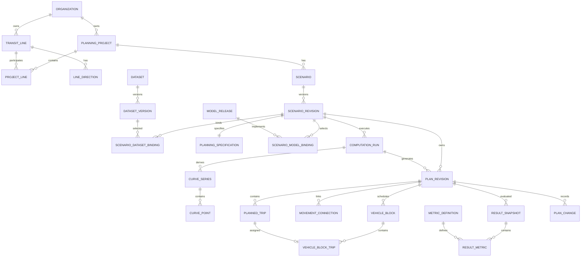

# OferBus — PostgreSQL Persistence Model v0.1

**Status:** first modern persistence contract; conceptual/logical model, not yet a production migration.  
**Date:** 2026-10-02  
**Scope:** PostgreSQL persistence only. This document deliberately does **not** choose frontend, backend framework, ORM, authentication provider, queue, deployment topology, or any other application architecture.

## 1. Decision boundary

The rematerialized OferBus will persist its modern domain state in PostgreSQL. Historical `.OFB/.LEV/.RST/...` formats are migration/archaeology inputs only and do not constrain this schema (ADR-0001).

This v0.1 is driven by the reconstructed domain and computational core already recovered from the legacy system. It formalizes the database concepts needed to preserve:

- multiple organizations (tenants);
- municipalities, operators, lines, directions, terminals, garages and vehicles;
- planning projects containing one or more lines;
- scenarios and immutable scenario revisions;
- observed datasets and immutable dataset versions;
- planning specifications and algorithm/model selection;
- deterministic computation runs with provenance;
- planned trips, real/virtual times and operational/deadhead semantics;
- structured links between trips, storage areas and garages;
- vehicle blocks and fleet results;
- derived curves and result metrics;
- coexistence of `legacy-exact`, `normalized` and future modern model results;
- manual interventions without silently overwriting generated results;
- audit/provenance sufficient to answer “where did this timetable/result come from?”.

Crew scheduling and optimization are represented in the domain but their detailed relational schemas are **not frozen in v0.1**, because archaeology still classifies parts of those subsystems as partial/evolving.

## 2. Central persistence principle: immutable revisions

The modern database must not model a scenario as a mutable bag of current values. The core lineage is:

```text
Organization
  → PlanningProject
    → Scenario
      → ScenarioRevision
        → ComputationRun
          → PlanRevision
            → ResultSnapshot
```

A `Scenario` is the user-facing alternative (“Base”, “Scenario A”, “Fleet reduction”, etc.). A `ScenarioRevision` freezes one reproducible set of inputs, dataset bindings, planning specifications and model selections. A `ComputationRun` records an execution against that immutable revision. A generated `PlanRevision` stores the resulting operational plan. Manual editing creates another `PlanRevision` derived from the previous one rather than modifying the generated plan in place. `ResultSnapshot` stores metrics calculated for a specific plan and semantic layer.

This structure is the database foundation for reproducibility and auditability.

## 3. Semantic layers

All computational results must identify one of the following semantic layers:

- `legacy-exact` — source-compatible behavior, including historically observed peculiarities/defects when intentionally preserved;
- `normalized` — recovered OferBus domain semantics with known implementation defects corrected or ambiguous representations normalized;
- `modern` — future scientifically/operationally updated models.

A semantic layer is not sufficient by itself. Results also reference concrete versioned model releases and a computation run.

## 4. Tenant isolation model

`organization_id` is the tenant key. Every tenant-owned aggregate and every independently queryable operational row carries it explicitly.

Required invariant:

> A foreign key between tenant-owned rows may only connect rows with the same `organization_id`.

The final physical migration must enforce this invariant at database level, preferably through composite tenant-aware foreign keys `(organization_id, id)` and/or another PostgreSQL-native isolation mechanism selected later. Application-only checking is insufficient.

This document does not yet choose the authentication/authorization architecture.

## 5. Identity and organizational context

### `organization`
Tenant boundary: municipality, authority, operator, consultancy or other institution using OferBus.

Core fields: `id`, `name`, `organization_type`, lifecycle timestamps/status.

### `app_user`
Stable OferBus user identity. It deliberately contains no password-storage decision. Authentication mechanism is deferred.

### `organization_membership`
Associates users and organizations and stores an authorization role/policy identifier without committing to a particular RBAC/ABAC framework.

### `municipality`
Municipality served/analyzed by an organization.

### `transit_operator`
Operator/company associated with lines and fleet.

## 6. Operational master data

### `terminal`
Named operational terminal or endpoint.

### `garage`
Garage/depot used as origin/destination of vehicle blocks.

### `vehicle_type`
Modern equivalent of the legacy vehicle model. Core scientific fields are explicit:

- seats;
- free standing area `[m²]`;
- descriptive/model identification.

Capacity by service level remains a derived computational concept and is not duplicated as authoritative persisted data.

### `vehicle`
Optional physical fleet unit. Planning may work purely with logical vehicle blocks; a physical vehicle assignment is therefore nullable.

### `transit_line`
Stable line identity. It must not absorb scenario-specific planning parameters.

### `line_direction`
Explicit direction belonging to a line. This replaces legacy fixed arrays `1 To 2` without imposing exactly two directions as a general database invariant.

Fields include origin/destination terminal and operational extension. The legacy line-operation classification can be preserved as metadata without constraining the modern relation.

## 7. Planning projects and scenarios

### `planning_project`
Container for a planning study. It can contain more than one line; therefore the modern database does **not** assume “one project = one line”.

### `project_line`
Many-to-many project/line association.

### `scenario`
Named alternative inside a project. Contains identity and presentation metadata, not calculated results.

### `scenario_revision`
Immutable reproducible revision of a scenario.

Core fields:

- sequential revision number;
- optional `parent_revision_id` (also supports branching/cloning lineage);
- author and creation timestamp;
- reason/comment;
- optional input fingerprint.

Once referenced by a computation run, its effective input state must not be mutated.

## 8. Observed data and dataset versioning

### `dataset`
Logical dataset identity. Examples: observed trips, monthly demand, vehicle catalog import, external interchange data.

### `dataset_version`
Immutable content version with provenance, observation/reference period and content digest.

### `scenario_dataset_binding`
Binds one dataset version to one scenario revision with an explicit role such as:

- `trip_observations`;
- `monthly_demand`;
- `vehicle_catalog`;
- future interchange/import roles.

### `trip_observation`
Recovered legacy observation semantics:

- direction;
- service-minute departure;
- transported passengers;
- passengers in the critical section;
- observed travel time.

There is no legacy array-size limit in the modern model.

### `monthly_demand_point`
One demand observation per calendar month. The old 60-month fixed array is an implementation artifact and is not preserved as a database limit.

## 9. Time representation

Operational schedule times must **not** use PostgreSQL `TIME` as the authoritative representation.

The model stores schedule positions as integer **service minutes** relative to a service-day origin. This preserves the recovered OferBus minute-based algorithms and supports trips after civil midnight without forcing them back into `[00:00, 24:00)`.

Examples:

- `real_departure_minute`;
- `virtual_departure_minute`;
- `real_arrival_minute`;
- `virtual_arrival_minute`.

Presentation conversion to clock time is a UI concern and is outside this persistence decision.

## 10. Planning specifications

### `planning_specification`
One immutable specification set per scenario revision. Stores global recovered parameters such as:

- service level;
- maximum headway/interval;
- project date/reference;
- demand method;
- use of forecast;
- creation of express/deadhead returns;
- valley level/capacity policy;
- optional historical 0/5-minute adjustment behavior;
- description/notes.

### `planning_direction_specification`
Direction-specific parameters including adjustment levels for:

- demand;
- travel time (TPV — Tempo de Percurso/Tempo de Viagem in the recovered model);
- IR — Índice de Renovação;
- MPTDC — Modelo de Períodos Típicos de Demanda Constante.

Legacy integer codes may be retained as migration evidence but must not be the only representation.

## 11. Versioned computational models

### `model_release`
Global catalog of immutable computational model releases.

Required fields:

- stable model key (e.g. `demand.mdv`, `demand.mptdc`, `travel-time.interpolation`, `renewal-index`, `minimum-timetable`, `vehicle-linking`);
- version label;
- semantic layer (`legacy-exact`, `normalized`, `modern`);
- source/code revision;
- algorithm/content digest;
- lifecycle/status.

### `scenario_model_binding`
For each scenario revision and computational purpose, identifies the selected `model_release` and its parameters.

`JSONB` is allowed here for model-specific parameter extension, but core stable domain attributes remain relational columns. The database must not devolve into an untyped JSON document store.

## 12. Computation provenance

### `computation_run`
Immutable execution record.

Core fields:

- scenario revision;
- run kind (`planning`, `recompute-results`, future `optimization`, etc.);
- semantic layer;
- engine/version/commit identification;
- deterministic seed when applicable;
- start/end timestamps and status;
- input fingerprint;
- output fingerprint;
- diagnostics/error summary.

A result without a computation run (or explicit manual origin) is not considered reproducible.

## 13. Derived curves

### `curve_series`
Metadata for a minute-indexed derived curve, including:

- direction;
- computation run;
- curve kind (`demand-original`, `demand-adjusted`, `travel-time`, `renewal-index`, etc.);
- unit;
- semantic layer/model release;
- covered service-minute range.

### `curve_point`
One value at one service minute. This is the reference logical representation. A future physical optimization (arrays/compression/partitioning) may be evaluated only after measurements; it must preserve equivalent semantics and provenance.

## 14. Operational plan revisions

### `plan_revision`
Immutable snapshot of an operational plan.

Kinds:

- `generated` — produced by computation;
- `manual` — derived from a prior plan through planner intervention;
- `imported/migrated` — optional legacy/external source.

Fields include `parent_plan_revision_id`, `source_run_id`, author, reason and revision number.

### `planned_trip`
Central operational entity reconstructed from legacy `TpObjViagem`.

Explicit fields replace packed legacy flags:

- line and direction;
- real/virtual departure and arrival service minutes;
- movement kind (`revenue-service`, `deadhead-express`, future kinds);
- provenance/origin (`generated`, `manual`, `imported`, `migrated`);
- service level result when applicable;
- optional `parent_trip_id` for lineage across plan revisions;
- optional `legacy_type_bits` only as archaeological/migration evidence.

The term “express” is preserved as a legacy label, but the reconstructed domain semantics are explicit: these movements are deadhead/operational movements and transport zero passengers.

## 15. Trip continuity and operational links

Packed legacy `Vinculos` is not authoritative modern storage.

### `movement_connection`
Represents continuity between operational movements:

- predecessor trip (nullable);
- successor trip (nullable);
- connection kind: `direct-trip`, `storage`, `garage`;
- terminal or garage when relevant;
- manual-override flag;
- dwell/connection metadata when needed.

Examples:

- garage → trip: predecessor null, successor set, kind `garage`;
- trip → garage: predecessor set, successor null, kind `garage`;
- trip → trip: both set, kind `direct-trip`;
- trip → storage → trip: both set, kind `storage`, terminal identified.

Database uniqueness must prevent a trip from having two active incoming or two active outgoing connections inside one plan revision.

## 16. Vehicle scheduling and fleet

### `vehicle_block`
One logical vehicle duty/block in a plan revision. May optionally reference a physical `vehicle`.

### `vehicle_block_trip`
Ordered membership of planned trips in a block. Each planned trip can belong to at most one vehicle block for that plan revision.

### `fleet_plan`
Persisted summary/provenance record containing at least:

- effective fleet;
- reserve policy/percentage;
- reserve fleet;
- total planned fleet.

The effective fleet remains derivable from blocks but is persisted in the result context to preserve historical calculated outputs and comparison snapshots.

## 17. Results and comparison layers

### `result_snapshot`
Immutable result set calculated for one plan revision.

Required dimensions:

- plan revision;
- computation run;
- semantic layer;
- model-set fingerprint;
- creation timestamp.

This permits, for example, `legacy-exact` and `normalized` results to coexist for exactly the same operational plan.

### `metric_definition`
Stable catalog of metrics and canonical units.

Examples already recovered:

- QDT — Quilometragem Diária Total;
- FE — Frota Efetiva;
- IPK — Índice de Passageiros por Quilômetro;
- mean passengers/trip;
- mean critical-section passengers/trip;
- projected mean occupancy rate;
- projected operational mean occupancy rate (normalized extension);
- daily total cost;
- cost/trip;
- cost/equivalent passenger;
- mean travel time;
- mean speed;
- worst projected occupancy/density.

### `result_metric`
Value of one metric in one snapshot, optionally scoped to a direction. Stores numeric/text value and unit where appropriate.

A metric value must never be detached from its result snapshot/semantic layer.

## 18. Manual intervention and provenance

The historical OferBus allowed the planner to alter trips, schedules and links. The web rematerialization must preserve that property without destructive overwrite.

### `plan_change`
Detailed change record for a manual plan revision:

- affected entity/type;
- changed field/operation;
- previous value;
- new value;
- actor;
- timestamp;
- reason/comment.

`before_value` and `after_value` may use `JSONB` because they represent heterogeneous audit payloads rather than primary domain state.

### `audit_event`
Higher-level audit trail for lifecycle actions such as scenario revision creation, calculation, plan publication/archival, dataset binding and administrative changes.

## 19. Units and numeric persistence

Reference persistence rules:

- schedule positions: integer service minutes;
- durations that require fractions: `NUMERIC`, explicitly documented in minutes or seconds;
- distances: `NUMERIC` in kilometres;
- passenger counts: integer when representing observed/calculated people after legacy rounding, `NUMERIC` for intermediate/curve values;
- densities: `NUMERIC`, passengers/m²;
- monetary values: `NUMERIC`, never binary floating point as authoritative storage;
- percentages/factors: `NUMERIC` with explicit semantic name;
- timestamps: `TIMESTAMPTZ`;
- model parameters: typed relational columns when stable; controlled `JSONB` only when model-specific/extensible.

## 20. Immutability rules

The following records are immutable after they become referenced/committed:

- `dataset_version`;
- `scenario_revision` effective inputs;
- `model_release`;
- `computation_run` inputs/identity after execution starts (status/diagnostics may transition);
- `plan_revision` content after finalization;
- `result_snapshot` and its metrics.

Corrections create new versions/revisions. This is intentional storage overhead in exchange for scientific reproducibility and public-sector auditability.

## 21. Core entity map



## 22. What is deliberately not frozen yet

The following are postponed until the requested consolidated archaeology/rematerialization review:

- application/backend architecture;
- frontend framework and visualization stack;
- ORM/query layer;
- authentication/identity provider;
- authorization implementation (RBAC/ABAC choice);
- PostgreSQL Row Level Security decision;
- API style;
- job/queue technology;
- deployment/cloud/container topology;
- detailed crew-scheduling schema;
- detailed optimization-run/decision-variable schema;
- GTFS/PostGIS integration;
- physical partitioning/index tuning beyond obvious reference indexes.

No decision in this v0.1 should be interpreted as selecting those technologies.

## 23. Acceptance check for persistence v0.1

| Criterion | Status |
|---|---|
| PostgreSQL is canonical modern persistence | PASS |
| Legacy files are not production storage contracts | PASS |
| Multi-tenant ownership represented | PASS |
| Project can contain multiple lines | PASS |
| Scenario branching/versioning represented | PASS |
| Immutable observed dataset versions represented | PASS |
| Algorithm/model version provenance represented | PASS |
| `legacy-exact` / `normalized` / `modern` coexistence represented | PASS |
| Planned trips preserve real/virtual time semantics | PASS |
| Deadhead/legacy-express semantics explicit | PASS |
| Trip links no longer stored as packed integer | PASS |
| Vehicle blocks and fleet represented | PASS |
| Manual edits preserve parent state and audit | PASS |
| Result snapshots are reproducible/versioned | PASS |
| Detailed crew schema finalized | UNKNOWN / intentionally deferred |
| Detailed optimizer schema finalized | UNKNOWN / intentionally deferred |
| Physical PostgreSQL migration executed/tested | NOT YET — outside this gate |

## 24. Next gate

**STOP after this persistence model.**

Before choosing any additional framework or architecture, the project must next present a consolidated view of:

1. what the archaeology established about OferBus;
2. what remains uncertain;
3. the complete rematerialization plan;
4. the proposed modern system architecture;
5. only then, the candidate technology/framework stack and implementation plan.
